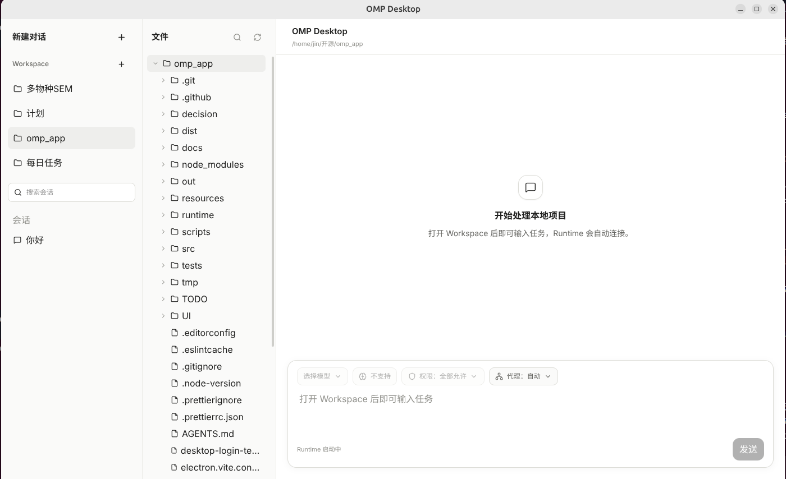

# OMP Desktop

面向本地项目的 OMP Agent 桌面客户端。把 Workspace、会话、文件和 Agent 任务放在同一个 Ubuntu 原生窗口中。

**[下载最新版本](https://github.com/LetItBe12345/omp_app/releases/latest)** · [安装说明](docs/ubuntu-installation.md) · [提交问题](https://github.com/LetItBe12345/omp_app/issues)

[](https://github.com/LetItBe12345/omp_app/releases/latest)
[](https://github.com/LetItBe12345/omp_app/actions/workflows/ci.yml)
[](docs/ubuntu-installation.md)
[](LICENSE)

<p align="center">
  
</p>

<p align="center"><sub>Ubuntu 24.04 · Wayland · 三栏 Workspace 工作界面</sub></p>

OMP Desktop 不是一个新的 IDE。它是 OMP 的图形工作台，让你在不离开项目上下文的情况下管理会话、选择文件、发送任务，并查看 Agent 的流式输出、Thinking、Tool Call 和权限请求。

## 当前能力

- 管理多个本地 Workspace，以及各 Workspace 下的会话。
- 在独立文件栏中浏览和搜索当前项目，将文件、目录或历史会话加入上下文。
- 查看流式回答、Thinking、工具执行状态和 Permission 请求。
- 选择模型、Thinking 等级和执行权限，支持 Stop 与逐条 Follow-up。
- 自动恢复上次 Workspace、会话、草稿和 Runtime 设置。
- 为 OMP Runtime 单独配置直连、自动代理或手动 HTTP 代理，不要求开启系统全局代理。
- 内置固定版本的 OMP Runtime，安装后不再下载应用组件。

## 安装

当前正式支持 Ubuntu 22.04 LTS、24.04 LTS x86-64。

从 [GitHub Releases](https://github.com/LetItBe12345/omp_app/releases/latest) 下载 `.deb` 和对应的 `.sha256` 文件：

```sh
sha256sum -c omp-desktop-0.1.0-linux-x64.deb.sha256
sudo apt install ./omp-desktop-0.1.0-linux-x64.deb
```

也可以下载 AppImage 直接运行。完整步骤、FUSE 要求和卸载方式见 [Ubuntu 安装说明](docs/ubuntu-installation.md)。

## 首次使用

第一次使用前，在终端配置 OMP Provider：

```sh
omp-desktop --setup-provider
```

这条命令会在当前终端启动应用内置的 OMP 配置界面。按提示完成 Provider 登录后退出，再从桌面启动器打开 OMP Desktop。

Desktop 不读取或保存 Provider Token。凭据由 OMP 自己管理。

进入应用后：

1. 点击 Workspace 旁的 `+`，选择本地项目目录。
2. 新建或打开一个会话。
3. 等待底部 Runtime 状态变为就绪。
4. 选择模型、Thinking 等级和权限模式，然后发送任务。
5. 通过文件树或输入框的 `@` 引用补充项目上下文。

遇到显卡驱动导致的黑屏时，可以用下面的命令进行临时诊断：

```sh
omp-desktop --disable-gpu
```

该参数只对本次启动生效，不是默认运行方式。

## Roadmap

- [x] Workspace、Session、文件上下文和流式 Agent 对话
- [x] Tool Call、权限确认、模型选择和 Runtime 代理设置
- [x] Ubuntu x64 AppImage 和 `.deb` 安装包
- [ ] Changes / Review 面板和按文件查看 Diff
- [ ] Accept、Revert、Open in Editor 和 `@diff` 上下文
- [ ] 内置多标签 Terminal
- [ ] 多 Session 并行运行和任务队列
- [ ] 应用内文件预览和编辑
- [ ] Browser Use、页面交互和独立代理环境
- [ ] Ubuntu Wayland Computer Use

Roadmap 按当前计划排序，不代表固定发布时间。命令和文件操作仍由本地 OMP Runtime 执行，并受当前权限模式控制。

`v0.1.0` 已在 NVIDIA RTX 3090 原生 Wayland 环境完成硬件验收。Intel、AMD 和 X11 真实硬件环境尚未纳入本次正式验收范围。

## 开发

需要 Node.js 24 和 pnpm 11：

```sh
pnpm install
pnpm runtime:download
pnpm dev
```

提交前运行：

```sh
pnpm check
pnpm build
```

`runtime/omp` 不提交到 Git。版本、下载地址和 SHA-256 固定在 `runtime/manifest.json`。Linux x64 打包命令：

```sh
pnpm package:linux
pnpm package:check
```

架构和 RPC 说明见 [Desktop 架构](docs/desktop-architecture.md) 与 [OMP RPC](docs/OMP_RPC.md)。发布验收和维护者流程见 [发布验收](docs/release-acceptance.md) 与 [发布流程](docs/releasing.md)。

## License

[MIT](LICENSE)
